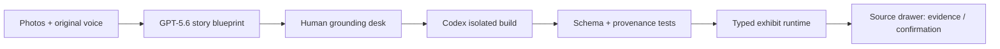

# Keepscape

> **Walk into a true story.**

Keepscape turns a small set of real photos and an original spoken memory into a source-grounded, playable
exhibit. GPT-5.6 builds the story blueprint, a person resolves what the sources cannot prove, and Codex creates
an interaction shaped around that specific story before the host validates it.

This is not a slideshow, a generic photo-to-3D converter, or an AI recreation of a person. Every factual detail
in an exhibit resolves to an inspectable source or an explicit human confirmation. The built-in judge archives
also demonstrate precise photo regions and narration timecodes. Generated scenery and connective language are
labeled as interpretation.

## Judge-ready path

No credentials are needed to evaluate the complete experience:

1. Run `pnpm install && pnpm dev`.
2. Open <http://localhost:3000>.
3. Choose **Lantern Lane, 1998** to play a source-backed collection trail.
4. Return to the studio and choose **Four Moves at the Repair Bench** to play an ordered repair ritual.
5. Open any exhibit object to inspect its source card and provenance status.
6. On the build screen, inspect **Build evidence** to see the actual run trace, checked artifact receipt, and
   validation results behind the exhibit.

The two included exhibits deliberately use different mechanics. They prove that the product unit is a bespoke
interaction, not a reskinned gallery template. The bundled archives are fictional, clearly labeled demonstration
material drawn as original SVGs; they make the product reliably testable without uploading private family media.

## Run locally

Requirements:

- Node.js 22 or newer
- pnpm 10.26 or newer
- Optional: an OpenAI API key for live GPT-5.6 analysis
- Optional: a local Codex login for live exhibit generation

```bash
pnpm install
cp .env.example .env.local
pnpm dev
```

Useful checks:

```bash
pnpm lint
pnpm typecheck
pnpm test
pnpm build
pnpm test:e2e
```

## Live generation

The built-in path is deterministic. Live generation is intentionally explicit because it processes personal
source material and can invoke a coding agent.

```bash
OPENAI_API_KEY=... \
OPENAI_MODEL=gpt-5.6 \
KEEPSCAPE_ENABLE_CODEX=1 \
pnpm dev
```

- `POST /api/blueprint` validates the request, then uses the OpenAI Responses API with GPT-5.6 structured
  output to produce grounded claims, source links, and a typed exhibit plan.
- `POST /api/build` invokes the Codex SDK only when `KEEPSCAPE_ENABLE_CODEX=1`. Codex works in an isolated,
  no-network directory and must return an exhibit that passes the same schema and provenance checks as the
  bundled cases.
- `CODEX_MODEL` is optional. When omitted, the SDK uses the Codex model supported by the signed-in account;
  it is intentionally separate from `OPENAI_MODEL`, which selects GPT-5.6 for the Responses API.
- If live credentials are absent, both routes return a labeled deterministic demonstration rather than
  pretending a model ran.

Keep credentials server-side. Do not enable Codex generation on a shared host without an isolated workspace.

## How GPT-5.6 is used

GPT-5.6 performs the semantic work that a template cannot:

- maps claims to the supplied photo and transcript evidence;
- separates supported claims from uncertainty and generated interpretation;
- identifies story beats, meaningful objects, and interaction affordances;
- emits a typed blueprint that can be reviewed before any experience is built.

The app never treats model confidence as evidence. Unsupported claims stay uncertain until a person confirms
them, and every downstream object retains its source references.

## How Codex is used

Codex was the primary engineering collaborator throughout Build Week and is also part of the product:

- it turned the evidence contract into the Zod schema and referential-integrity checks;
- it generated two story-specific interaction implementations in parallel;
- it built and visually refined the responsive studio and exhibit runtime;
- it wrote unit, accessibility, and browser tests and repaired failures found during QA;
- in live mode, it converts an approved blueprint into a typed exhibit package, runs the checks, and returns a
  build receipt rather than unverified code.

The human decisions are recorded in [`docs/DECISIONS.md`](docs/DECISIONS.md), including discarded directions
and the point where evidence and safety constraints were chosen. This makes the collaboration inspectable
instead of presenting the final code as an unexplained model output.

A redacted, reproducible live Codex SDK receipt is checked in at
[`docs/evidence/codex-live-run.json`](docs/evidence/codex-live-run.json). Run `pnpm verify:codex` with a signed-in
Codex CLI to generate a fresh receipt; no source media or credentials are retained.

## Architecture



The browser renders a small, typed interaction language instead of executing arbitrary generated JavaScript.
That gives Codex room to design a bespoke mechanic while keeping the judge path portable and reviewable.

## Repository map

```text
src/app/                 Next.js studio and server routes
src/components/studio/   Source review and build journey
src/components/exhibit/  Keyboard- and touch-friendly playable runtime
src/lib/                 Schemas, deterministic exhibits, GPT-5.6/Codex pipeline
public/samples/          Original fictional archive illustrations
docs/                    Decisions, event truth, demo and submission material
```

## Privacy and truth policy

- Raw family media is not committed to this repository.
- The deterministic samples are fictional and visibly labeled.
- No voice cloning, face recreation, or simulation of a deceased person.
- No claim without a source reference or explicit human confirmation.
- Generated interpretation is visually distinct from sourced memory.
- Live uploads are processed only for the requested generation and are not intentionally persisted by the app.

## License

The source code and original sample illustrations are released under the [MIT License](LICENSE).
