# Keepscape

> **Walk into a true story.**

Keepscape turns three to five real photos and an original spoken memory into a source-grounded, walkable
memory space. GPT-5.6 produces a strict source-linked story blueprint; the host compiles the supplied photos
into a safe diorama; a person resolves uncertain claims and reviews the displayed generated story copy; Codex
returns a typed interaction plus a bounded spatial plan that the host compiles and validates structurally; and
the person approves Codex's final interaction-state wording before entry.

This is not a slideshow, photogrammetry, NeRF, or an AI recreation of a person. The browser space is a generated
spatial interpretation—not recovered geometry. Every factual detail resolves to an inspectable source or an
explicit human confirmation. The manually calibrated judge fixtures demonstrate reviewed photo regions and
narration timecodes; layout, depth, lighting, motion, and connective scenery stay visibly labeled as
interpretation.

**Live judge experience:** <https://keepscape.lucasfutures-h1-20260507.workers.dev>

## Judge-ready path

No credentials are needed to evaluate the complete experience. The public path is a verified replay with a
visible fallback trace, not a disguised live GPT-5.6 or Codex run:

1. Run `pnpm install && pnpm dev`.
2. Open <http://localhost:3000>.
3. Choose **Lantern Lane, 1998** to move through a three-photo memory corridor and collect its source-backed
   lanterns.
4. Return to the studio and choose **Four Moves at the Repair Bench** to play an ordered repair ritual.
5. Turn on **Evidence Lens**, then open an object to inspect its cited source view, audio timecode, and
   provenance status. The manually calibrated judge fixture also outlines a reviewed photo region.
6. On the build screen, inspect **Build evidence** to see the actual run trace, checked artifact receipt, and
   validation results behind the exhibit.

The two included exhibits deliberately use different mechanics. Lantern Lane unfolds three consistent photo
views into a bounded CSS-3D diorama; Repair Bench uses an ordered ritual. Together they prove that the product
unit is a story-specific interaction, not a reskinned gallery template. The bundled archives use clearly
labeled AI-generated fictional photos, original stage SVGs, and synthetic narration so the complete path is
testable without publishing private family media.

## Run locally

Requirements:

- Node.js 22 or newer
- pnpm 10.26 or newer
- Optional: an OpenAI API key for live GPT-5.6 analysis
- Optional: a local Codex login for live exhibit generation

```bash
pnpm install
cp .env.example .env.local
pnpm dev
```

Useful checks:

```bash
pnpm lint
pnpm typecheck
pnpm test
pnpm build
pnpm test:e2e
```

## Live generation

The built-in path is deterministic. Live generation is intentionally explicit because it processes personal
source material and can invoke a coding agent.

```bash
OPENAI_API_KEY=... \
OPENAI_MODEL=gpt-5.6 \
KEEPSCAPE_ENABLE_CODEX=1 \
pnpm dev
```

- `POST /api/blueprint` validates the request, then uses the OpenAI Responses API with GPT-5.6 structured
  output to produce claims, hotspots, narrative copy, and source links. GPT-5.6 does not emit spatial geometry
  or shared cross-photo anchors; the host compiles the three to five photo sources into a safe diorama.
- `POST /api/build` invokes the Codex SDK only when `KEEPSCAPE_ENABLE_CODEX=1`. Codex works in an isolated,
  no-network directory with an ephemeral `CODEX_HOME`, a minimal process environment, and no inherited shell
  variables. It returns only a typed interaction plus a bounded plan containing a preset and an ordered list of
  existing photo source IDs. The host applies canonical slots and rejects invalid references.
- `CODEX_MODEL` is optional. When omitted, the SDK uses the Codex model supported by the signed-in account;
  it is intentionally separate from `OPENAI_MODEL`, which selects GPT-5.6 for the Responses API.
- If live credentials are absent, both routes return a labeled deterministic demonstration rather than
  pretending a model ran.

Keep credentials server-side. Do not enable Codex generation on a shared host without an isolated workspace.
The implementation deletes both the workspace and isolated Codex home after each run and never writes host
artifacts back into the agent-writable directory after the turn.

## How GPT-5.6 is used

GPT-5.6 performs the semantic work that a template cannot:

- maps claims to supplied photo evidence and story text;
- separates supported claims from uncertainty and generated interpretation;
- identifies story beats and meaningful hotspots;
- drafts scene titles, narration, and hotspot titles/descriptions inside a strict source-linked blueprint;
- emits presentation coordinates that the host treats only as generated display hints, never source geometry.

The app never treats model confidence as evidence. Unsupported claims stay uncertain until a person confirms
them, and every downstream object retains its source references. Before build, the source desk requires a
person to resolve every uncertain claim and explicitly review the displayed generated scene titles, narration,
and all other GPT-authored exhibit, scene, hotspot, and interaction-draft copy shown at the source desk. A
text-only story note is never presented as audio evidence; claims relying on it stay uncertain until the person
confirms or preserves them. After Codex compiles the interaction, the final prompt and completion/retry wording
remain visible for explicit human approval before entry.

## How Codex is used

Codex was the primary engineering collaborator throughout Build Week and is also part of the product:

- it turned the evidence contract into the Zod schema and referential-integrity checks;
- it generated two story-specific interaction implementations in parallel;
- it built and visually refined the responsive studio and exhibit runtime;
- it helped implement the bounded photo-diorama presets and Evidence Lens without allowing arbitrary generated
  CSS or browser code;
- it wrote unit, accessibility, and browser tests and repaired failures found during QA;
- in live mode, it returns a strict build report with a typed interaction and the minimal spatial plan
  `{ preset, orderedPhotoSourceIds }`; the host—not Codex—checks the exact source set, rebuilds canonical plane
  slots, rebinds references, validates the final schema, and records the receipt.

The human decisions are recorded in [`docs/DECISIONS.md`](docs/DECISIONS.md), including discarded directions
and the point where evidence and safety constraints were chosen. This makes the collaboration inspectable
instead of presenting the final code as an unexplained model output.

A redacted, reproducible live Codex SDK receipt is checked in at
[`docs/evidence/codex-live-run.json`](docs/evidence/codex-live-run.json). Run `pnpm verify:codex` with a signed-in
Codex CLI to generate a fresh receipt; no source media or credentials are retained.

## Architecture

```mermaid
flowchart LR
  A[3–5 photos + transcript or story note] --> B[GPT-5.6 strict source-linked blueprint]
  B --> C[Host compiles safe photo diorama]
  C --> D[Human resolves uncertainty + reviews displayed story copy]
  D --> E[Codex: typed interaction + preset + ordered photo IDs]
  E --> F[Host allowlists IDs, applies canonical slots, validates references + schema]
  F --> G[Human approves final interaction copy]
  G --> H[Host CSS presets + typed runtime]
  H --> I[Evidence Lens: cited view or reviewed region]
```



The browser renders a small, typed interaction language with host-authored CSS presets instead of executing
arbitrary generated JavaScript, CSS, transforms, or shaders. Structural validation proves that IDs and
references are allowed and complete; it does not prove that generated wording is historically true. That is
why the human language gate is required.

## Repository map

```text
src/app/                 Next.js studio and server routes
src/components/studio/   Source review and build journey
src/components/exhibit/  Keyboard- and touch-friendly playable runtime
src/lib/                 Schemas, deterministic exhibits, GPT-5.6/Codex pipeline
public/samples/          Generated fictional photos, stage art, and synthetic audio
docs/                    Decisions, event truth, demo and submission material
```

## Privacy and truth policy

- Raw family media is not committed to this repository.
- The deterministic samples are fictional and visibly labeled.
- No voice cloning, face recreation, or simulation of a deceased person.
- No claim without a source reference or explicit human confirmation.
- Generated interpretation is visually distinct from sourced memory.
- Live uploads are processed only for the requested generation and are not intentionally persisted by the app.

## License

The source code and bundled fictional demo assets are released under the [MIT License](LICENSE).
